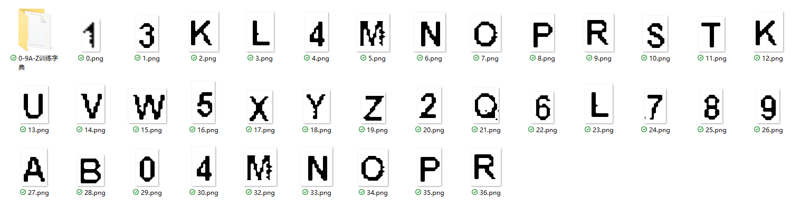
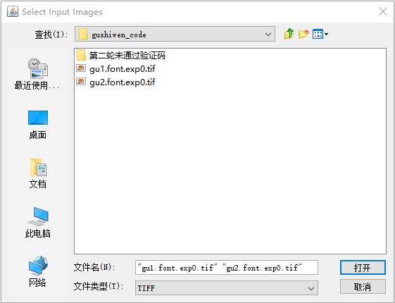

# 验证码识别-训练字库
## Purpose
>验证码的存在使得在模拟登陆时会遇到障碍，通过训练通用验证码识别库，可以通过加入几行代码轻松登陆，对网页进行测试\
>通过建立特征字符库，逐层加入识别错误的验证码进行补充训练，可以在三次扩充样本训练后达到90%以上识别率\
>
## Tools
>**Tesseract**
>>**基于OCR原理**：Optical Character Recognition，光学字符识别，是指通过扫描字符，然后通过其形状将其翻译成电子文本的过程。\
对于图形验证码来说，它们都是一些不规则的字符，这些字符确实是由字符稍加扭曲变换得到的内容。\
>>[Windows安装Tesseract-OCR 4.00并配置环境变量](https://segmentfault.com/a/1190000014086067):现在最新版本为5.00,安装及配置方法一致\
>>[tesseract v4.0.0 帮助文档解读](https://blog.csdn.net/qq_32674197/article/details/80744783)

>**jTessBoxEditor**
>>安装后记得把ocr目录下文件全部替换成Tesseract的OCR目录下的文件

>**pytesseract**
>>安装：**pip install pytesseract**\
>>简介:基于Tessract的图片光学字符识别库\
>>[官方文档](https://pypi.org/project/pytesseract/)


>**PIL**
>>类似与OpenCV的图像处理库，用于验证码的预处理\
>>[PIL介绍](https://www.cnblogs.com/lyrichu/p/9124504.html)\
>>[Python图像处理库PIL的ImageEnhance模块介绍](https://blog.csdn.net/icamera0/article/details/50753705)

## Training
>**预处理验证码图片**
>>目的：原始验证码图片存在背景纹路等干扰，通过PIL库的ImageEnhance模块进行预处理，突出文本\
>>下面代码介绍了一种参数配置方法，可以很有效突出识别文本特征
>>```python
>>from PIL import Image
>>from PIL import ImageEnhance
>>img = Image.open('exe_file/11/code1.png')
>>print(img)
>>img= img.convert('RGB')
>># 颜色调到最暗
>>enhancer = ImageEnhance.Color(img)
>>enhancer = enhancer.enhance(0)
>># 增加亮度
>>enhancer = ImageEnhance.Brightness(enhancer)
>>enhancer = enhancer.enhance(4)
>># 增加对比度
>>enhancer = ImageEnhance.Contrast(enhancer)
>>enhancer = enhancer.enhance(15)
>># 增加图片锐度
>>enhancer = ImageEnhance.Sharpness(enhancer)
>>img = enhancer.enhance(25)
>># img.show()
>># 转成灰度图片
>>img = img.convert('L')
>># img.show()
>>#二值化处理
>>threshold = 140
>>table=[]
>>for i in range(256):
>>    if i < threshold:
>>        table.append(0)
>>    else:
>>        table.append(1)
>>out = img.point(table,'1')
>>out.show()
>>```
>**第一次训练：建立单字符字库**
>>对于该网站，验证码只存在0-9A-Z 36个字符，单独提取36个字符的图片，采用默认字库进行训练，利用jTessBoxEditor进行矫正后生成新字库\
>>

>**第二次训练：扩充字库**
>>python脚本获取识别错误的验证码（脚本最后会给出传送门）\
>>利用jTessBoxEditor将错误识别的验证码集成tif文件与第一次字库的训练样本(tif文件)合并\
>>\
>>利用第一次训练的字库将tif文件进行测试，生成box文件，进行人工纠错\
>>**操作**
>>>将文件路径改为tif文件所在目录\
>>>tif文件命名规则 [语言名].[font].[exp0].tif\
>>>gu是第一轮训练的字库名
>>```commandline
>>cd C:\Users\crayon\OneDrive\Pycode\Crawler\crawler_Basic\exe_file\11\gushiwen_code
>>
>>tesseract gu.font.exp0.tif gu.font.exp0 -l gu --psm 7 batch.nochop makebox
>>```
>>更新字库
>>```commandlinecd 
>>C:\Users\crayon\OneDrive\Pycode\Crawler\crawler_Basic\exe_file\11\gushiwen_code
>>echo font 0 0 0 0 0>font_properties
>>
>>echo Run Tesseract for Training..
>>tesseract.exe --psm 10 gu.font.exp0.tif gu.font.exp0 nobatch box.train
>>
>>echo Compute the Character Set..
>>unicharset_extractor.exe gu.font.exp0.box
>>mftraining -F font_properties -U unicharset -O gu.unicharset gu.font.exp0.tr
>>
>>echo Clustering..
>>cntraining.exe gu.font.exp0.tr
>>
>>echo Rename Files..
>>rename normproto gu.normproto
>>rename inttemp gu.inttemp
>>rename pffmtable gu.pffmtable
>>rename shapetable gu.shapetable
>>
>>echo Create Tessdata..
>>combine_tessdata.exe gu.
>>```

>第n次训练
>>同第二次训练步骤\
>>遇到的问题：Empty Page 一般是没有指定训练模式造成的，通过设置psm可以解决

## references
>[python+tesseract 训练和破解验证码](https://zhuanlan.zhihu.com/p/40178190)
>>非常详细地介绍了训练字库的步骤，比较有特色的是该作者利用字符色彩不同进行单字符提取，但是这仅对单个字符同色位有效\
>>对于本文的验证码，这种方法就无效了，还是需要利用截图工具

>[Tesseract-OCR样本训练方法](https://blog.csdn.net/sylsjane/article/details/83751297)
>>介绍了指令文件运行，写成bat文件后就不用重复劳动

>[字库合并](https://www.imooc.com/article/32331)
>>本文提出的方法有个缺陷，每次都需要对图片集人工矫正一遍，但实际前一次训练图片集一般是不需要校对的\
>>这篇文章介绍了box文件合并的技巧，每次只需对新加入的样本进行矫正，从而可以减少训练字库的工作量

## Resource
>[python验证码测试脚本](https://github.com/ZhuoZhuoCrayon/pythonCrawler/blob/master/11.2jTessBoxEditor-tesseract.py)
>>[功能1]图片预处理，突出文本\
>>[功能2]验证码测试，利用训练的字库测试验证码，将无法正确识别的验证码保存

>[训练字库](https://github.com/ZhuoZhuoCrayon/pythonCrawler/blob/master/exe_file/11/gushiwen_code/gu.traineddata)
>>该字库在第三轮训练中产生，可以达到90%以上的准确率

>训练命令行指令文件
>>[生成box文件](https://github.com/ZhuoZhuoCrayon/pythonCrawler/blob/master/exe_file/11/gushiwen_code/train_toBox.bat)\
>>[生成字库](https://github.com/ZhuoZhuoCrayon/pythonCrawler/blob/master/exe_file/11/gushiwen_code/gu.bat)

>[训练文件集合](https://github.com/ZhuoZhuoCrayon/pythonCrawler/tree/master/exe_file/11/gushiwen_code)
>>保存了每次训练的图片集合、tif、box、训练字库等文件 
